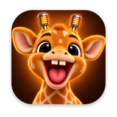
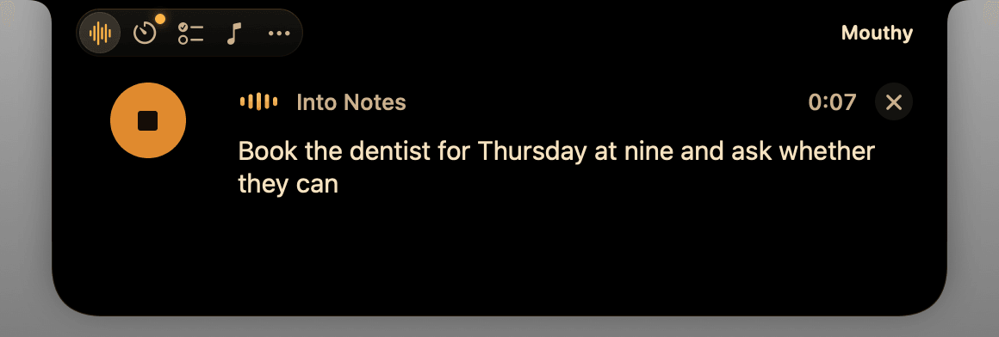

<h1 align="center">Mouthy</h1>

<b>Talk, and it types.</b> Free, open-source dictation that runs entirely on your computer. No account, no subscription, no cloud.

<a href="https://github.com/LayerMakerLab/mouthy/releases/latest"><b>Download</b></a> · <a href="https://mouthy.dev">mouthy.dev</a>

Press a shortcut, speak, press it again. Your words appear wherever your cursor is.

## Get started

**Mac** (macOS 26 or later, Apple silicon or Intel)

1. Download the Mac ZIP from [Releases](https://github.com/LayerMakerLab/mouthy/releases/latest), open it and drag **Mouthy** into Applications.
2. Open Mouthy. The welcome screens ask for the microphone and for Accessibility, which lets Mouthy type into other apps.
3. Double-tap the right ⌘, talk, and double-tap it again. ⌃⌥Space and Hold Fn are in Settings → Shortcut. Press Return while you talk to send what you've said so far; Mouthy keeps listening (it asks for Input Monitoring the first time).

Updates arrive on their own: Mouthy checks once a day, downloads a new version in the background and installs it when you quit.

**Windows** (64-bit)

1. Download the Windows ZIP from [Releases](https://github.com/LayerMakerLab/mouthy/releases/latest), unzip it, right-click `install-windows.ps1` and choose *Run with PowerShell*.
2. Press Ctrl+Alt+Space, talk, and press it again.

Mouthy isn't code-signed on Windows yet. If Windows says it protected your PC, choose *More info* → *Run anyway*.

**Linux** (x86-64, Wayland or X11)

1. Download the Linux `.tar.gz` from [Releases](https://github.com/LayerMakerLab/mouthy/releases/latest), unpack it and run `./install.sh`.
2. Press Ctrl+Alt+Space, talk, and press it again. Wayland doesn't let apps register shortcuts: install `wl-clipboard` and `wtype`, and bind a key in your compositor to `mouthy --toggle`.

To hear about new Windows and Linux versions, choose **Watch → Custom → Releases** at the top of this page.

| | Speech engines |
| --- | --- |
| **Mac, Apple silicon** | Apple Speech, NVIDIA Parakeet, OpenAI Whisper |
| **Mac, Intel** | NVIDIA Parakeet |
| **Windows, Linux** | NVIDIA Parakeet, OpenAI Whisper |

Every engine runs on your own computer. A model downloads once, when you choose it, and then works offline. See [Speech engines](docs/engines.md).

## If something isn't right

- **Nothing types (Mac).** Turn Mouthy on in System Settings → Privacy & Security → Accessibility.
- **A word keeps coming out wrong.** On the Mac, add it in Vocabulary. Anywhere, another speech engine in Settings may suit your voice better.
- **Anything else.** [Open an issue](https://github.com/LayerMakerLab/mouthy/issues/new/choose). A short description and your platform are enough.

## Highlights

- **Types anywhere.** Text goes into whatever app has focus, with spacing and capitals fitted to what is already there (Mac and Windows).
- **Enter sends, Escape cancels.** Press Enter while talking to send what you have said so far and keep going.
- **Speech only types.** Nothing you say can send, click or run anything.
- **Spoken punctuation and fixes.** "comma", "new paragraph", and "scratch that" to drop the last sentence.
- **Modes.** Different styles per app or website, for example plain text for chat and code formatting in your editor.
- **Meetings.** Records your microphone and the call's audio, then writes a transcript.
- **For AI agents.** Claude Code and other agents can ask you a question and hear your spoken answer.
- **Notch hub (Mac).** Timers, notes, music and your calendar in a panel that opens from the notch.

Full list: [Features](docs/features.md).

## Privacy

- Dictation audio stays in memory and is never saved.
- No telemetry and no account. Mouthy goes online only to download the speech models you picked (plus a small voice-activity model on the Mac) and, on the Mac, to fetch lyrics, artwork and weather for the notch hub and to check once a day for a new version (Settings → Privacy → Check for updates automatically). Local Only Mode turns all of it off.
- History is off by default.

Details: [Privacy and security](docs/privacy.md).

## Documentation

- [Features](docs/features.md): everything Mouthy does, per platform
- [Speech engines](docs/engines.md): which engine to pick, languages and download sizes
- [Privacy and security](docs/privacy.md)
- [AI agents](docs/agents.md): connect Claude Code and other MCP clients
- [Command line](docs/command-line.md)
- [Building and testing](docs/building.md)

## Contributing

Bug reports and pull requests are welcome. Read [CONTRIBUTING.md](CONTRIBUTING.md) first. Report security problems privately as described in [SECURITY.md](SECURITY.md).

## License

Copyright © 2026 LayerMaker LLC. Mouthy is free software under the [GNU General Public License v3.0](LICENSE).

Speech models and third-party libraries keep their own licenses: [Mac](mac/Resources/ThirdParty/NOTICE.md), [Windows and Linux](windows-linux/THIRD-PARTY.md).
